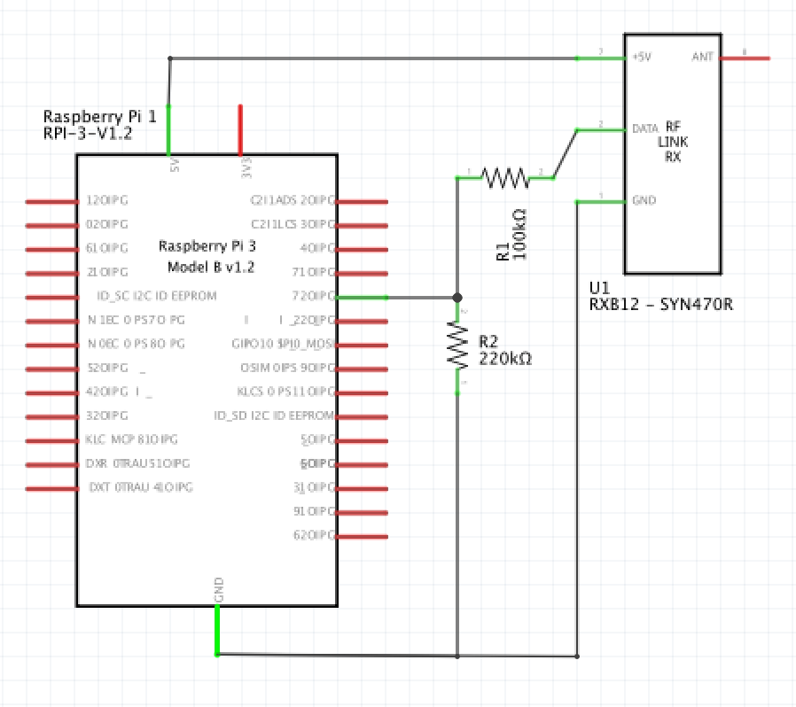

# Why do you need a RF to REST bridge?
I wrote this REST frontend in order to integrate readily available & cheap wireless sensors to building automation software like [OpenHab](https://www.openhab.org/).

At its core this frontend runs an [rcswitch](https://github.com/sui77/rc-switch) based sniffer on a Raspberry Pi which provides a webhook mechanism to notify other REST services when a code is decoded.

The advantage of providing REST webhooks is that you can have several RPis receiving RF signals and reporting back to a central house automation platform. 


# About the hardware setup
I used a RXB12 receiver which I hooked to a Raspberry Pi as shown on the diagram below. The wiring is straight forward. We only need a voltage divider to interface the 5V output of the RF module to the 3.3V input on the Raspberry.



My goal was to support a collection of sensors, garage openers and push buttons. RCSwitch can handle most of them out of the box. I only had to add support for Holtek's HT12E (the changes have been contributed back to RCSwitch).

Here is a picture of the sensors I have tested successfully. All of them operate on 433Mhz. Some of them are branded Kerui, but I have found that any cheap 433Mhz sensor works.


# About the software setup
The server is written in NodeJS and uses restify to handle HTTP connections. The webhook API leverages [node-webhooks](https://github.com/roccomuso/node-webhooks). In order to install the server clone this repository and do `npn install`. As part of the installation npn will clone the rcswitch repository and build a native RFSniffer (based [433Utils](https://github.com/ninjablocks/433Utils)). RFSniffer requires git, build-essential and WiringPi to be installed on the Raspberry Pi.

For starter just launch the server doing `node index.js`. You should see an eventcode on the console every time you press a button on your RF device. I encourage you to look at `config.js` and `rf433-app.conf`for additional setup details. This later file can then be copied to `/etc/init` to register the server with the OS upstart service.

# Using the REST bridge

Callbacks can be registered using the following API. The webhook name can be `'all'` or the RF code in hex (for example: `'0x00C03562'`)

- `GET /api/webhook/get` Return the list of all the registered hooks.
- `GET /api/webhook/get/[WebHookShortname]` Return the selected WebHook.
- `POST /api/webhook/add/[WebHookShortname]` Add a new URL for the selected webHook. Requires JSON params:
- `GET /api/webhook/delete/[WebHookShortname]` Remove all the urls attached to the selected webHook.
- `POST /api/webhook/delete/[WebHookShortname]` Remove only one single url attached to the selected webHook. A json body with the url parameter is required: { "url": "http://..." }
- `POST /api/webhook/trigger/[WebHookShortname]` Trigger a webHook. It requires a JSON body that will be turned over to the webHook URLs. You can also provide custom headers.

If the registration is successful, when an RF code is received you will get a callback with a JSON body like the following
```JSON
{
	"code":"0x007A8F99",
	"bits":"24",
	"protocol":"1",
	"delay":"324",
	"receiver":"living"
}
```

The following example shows how to register two callbacks into OpenHab to turn a light ON or OFF depending on what button is pressed

```bash
$ curl 'http://raspi-living:8000/api/webhook/add/0x0012C342' -H 'Content-Type: application/json' --data-binary '{"url":"http://raspi-ss:8080/CMD?SS_S02_G=OFF"}'

$ curl 'http://raspi-living:8000/api/webhook/add/0x0012C344' -H 'Content-Type: application/json' --data-binary '{"url":"http://raspi-ss:8080/CMD?SS_S02_G=ON"}'
```
